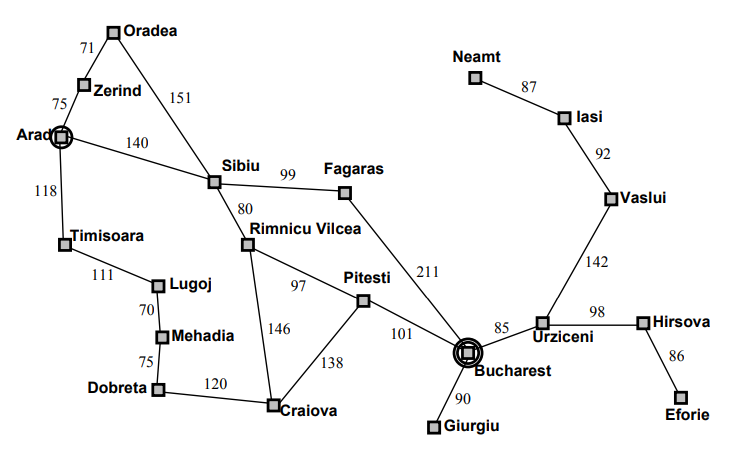
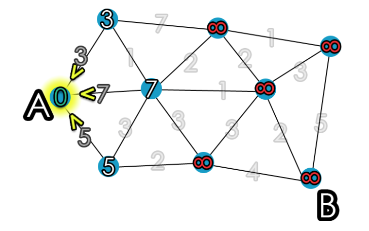
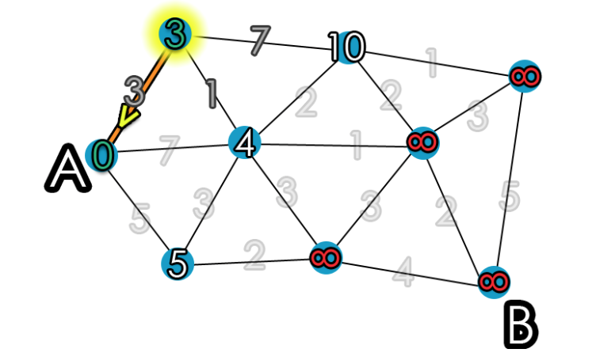

# Arad-Bucharest the shortest path

## Task
Find the shortest path from **Arad** to **Bucharest** in the weighted graph using Dijkstra's algorithm. 

## Graph 


The graph has the following:

- nodes (cities)
- weighted edges that connect two nodes (distance)

## Data
Graph was saved in .txt file as follow (the graph is undirected):
```
# city city distance
Zerind Arad 75
Sibiu Arad 140
Timisoara Arad 118
...
```

## Dijkstra's algorithm 
Let **v, u** be neighbour nodes and **w(v,u)** denote edge's weight, and **s** be the source node. 

### Variables initialization
- **dist** : a dictionary of distance from the source node **s** to each node in the graph

- **Q**, a queue of unvisited nodes in the graph. Initially stores all nodes and at the end of the algorithm's progress, Q will be empty. 

- **S**, a set of visited nodes. Initially it's empty and at the end will contain all the nodes of the graph.

### Step by step
1. Mark all nodes unvisited and store them in a queue Q.  
2. Set the distance to zero for our initial node **dist(s) = 0** and to infinity for other nodes **dist(v) = inf**.


3. Select the unvisited node **v** with the smallest distance **dist(v)**, it's current node now.



4. Find unvisited neighbors for the current node and calculate their distances through the current node. Compare the newly calculated distance to the assigned and save the smaller one.



5. Mark the current node as visited - add **v** to **S** and remove it from the unvisited set **Q**.
6. Stop, if the destination node has been visited (when planning a route between two specific nodes) or if the smallest distance among the unvisited nodes is infinity. If not, repeat steps 3-6.


### Results 
**dist** now contain the shortest path from source **s**.

## Implementation 
``` python
    def find_shortest_path(self, source, target):
        ''' Find the shortest path between source and target node
        using Dijkstra's algorithm. '''

        assert source in self.vertices, 'Provided source does not exist.'
        assert target in self.vertices, 'Provided target does not exist.'

        # create dictionaries with distances and visited nodes
        # set the distance to inf for nodes except the initial one 
        distances = {vertex: float('inf') for vertex in self.vertices}
        previous_vertices = {vertex: None for vertex in self.vertices}

        # set the distance to zero for initial node
        distances[source] = 0
        vertices_unvisited = self.vertices.copy()

        # untill the vertices list is empty 
        while vertices_unvisited:
            # select the unvisited node with the smallest distance 
            current_vertex = min(vertices_unvisited, 
                                 key=lambda vertex: distances[vertex])
            # remove current node from unvisited nodes list
            vertices_unvisited.remove(current_vertex)

            if distances[current_vertex] == float('inf'):
                break

            # find unvisited neighbours for the current node
            for neighbour, weight in self.neighbours[current_vertex]:
                alternative_route = distances[current_vertex] + weight

                # save the smaller distance 
                if alternative_route < distances[neighbour]:
                    distances[neighbour] = alternative_route
                    previous_vertices[neighbour] = current_vertex

        path, current_vertex = deque(), target
        while previous_vertices[current_vertex] is not None:
            path.appendleft(current_vertex)
            current_vertex = previous_vertices[current_vertex]
        if path:
            path.appendleft(current_vertex)

        return path
```

## Setup
Run the script in the terminal:
``` bash 
python dijkstras_algo.py
```

## Results 
``` bash
The shortest path from Arad to Bucharest
deque(['Arad', 'Sibiu', 'Rimnicu_Vilcea', 'Pitesti', 'Bucharest'])
```

## Sources
1) https://brilliant.org/wiki/dijkstras-short-path-finder/
2) https://dev.to/mxl/dijkstras-algorithm-in-python-algorithms-for-beginners-dkc

