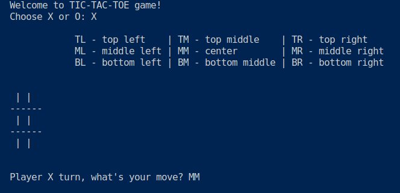

# Tic-tac-toe game
User plays against computer. The game is run in the terminal. 

## Setup 
``` bash 
cd scripts
python tic-tac-toe_game.py
```

## Sneak peak 
- welcome screen 



- game over


## Strategy 
Computer uses random strategy by default. To improve the performance the **Minimax algorithm** is being developed, although now it is at the beta test stage.     