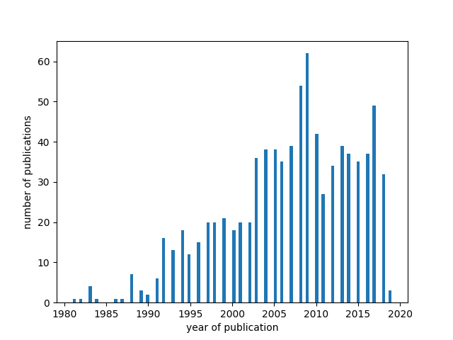
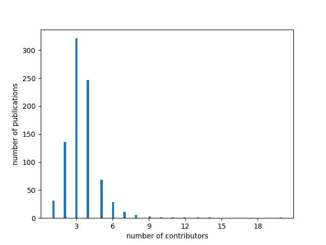
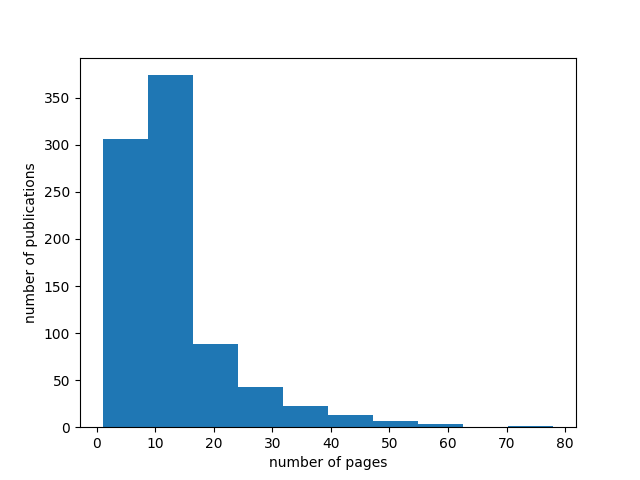
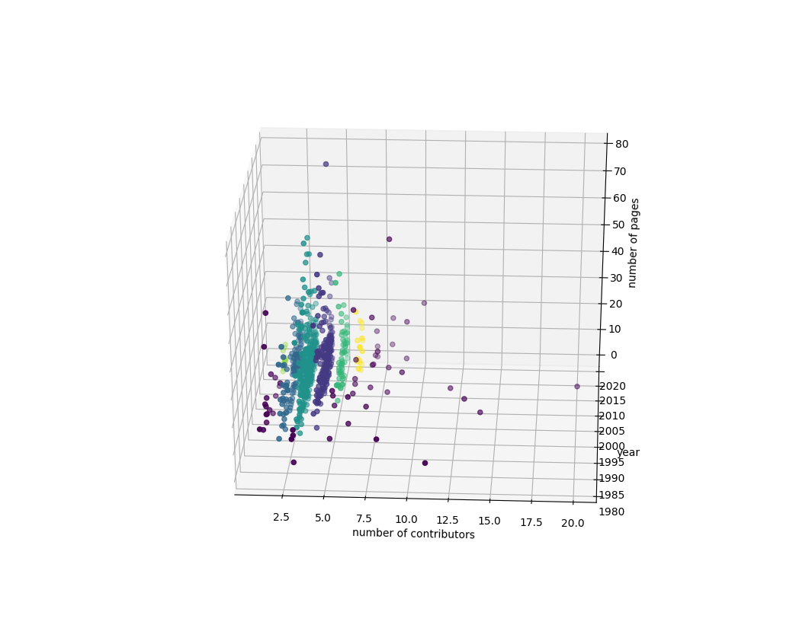

# Clustering publication data

## Preprocessing data
From the XML file the following information were parsed:
- title
- year of publication
- number of pages
- number of contributors 

In the next step instances with number of pages > 100 were removed.  
For the numerical features Z-score was computed. Records which standed out more than 3*std were dropped. 

## 1D clusterization 
a)  **Cluster by the year of publication**

Below you can see the distribution of the year of publication. 

The most papers (60) were published in 2009.

b) **Cluster by the number of contributors** 

Below you can see the distribution of the year of publication. 

The most popular number of contributors was 3. 

c) **Cluster by the number of pages**

Below you can see the distribution of the number of pages. 

Most publications have number of ranges within range [10,15].

## 3D clusterization 

DBSCAN algorithm was used to cluster data based on the 3 features:
*number of contributors, year of publication, number of pages*. 
The result is presented below:

